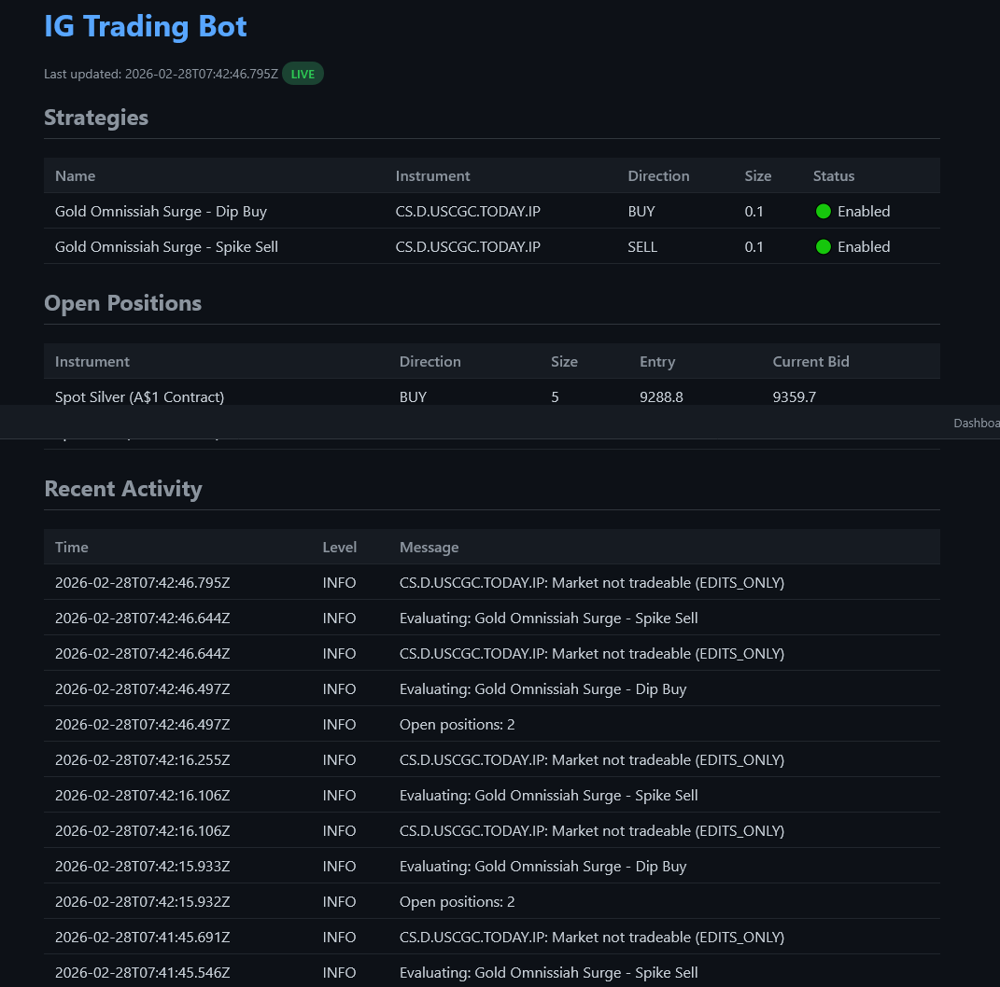
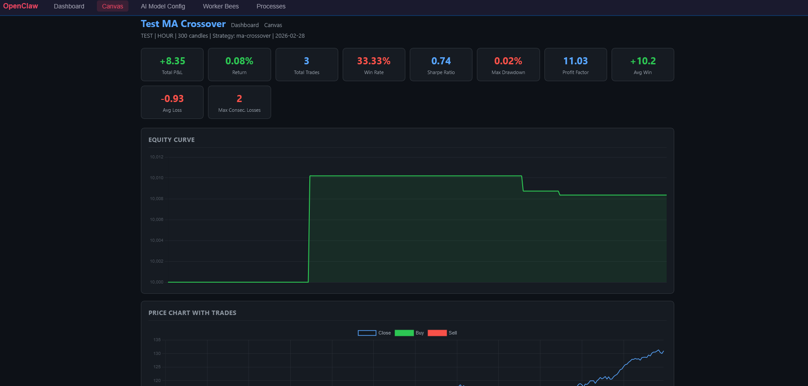

# IG Group CFD Trading Setup Guide

This guide covers setting up and configuring IG Group CFD trading on OpenClaw Cloud, including API connection, automated bots, rate limits, and the trade proof reader.


## Prerequisites

You need an IG Group account with API access enabled.

### Demo Account (Recommended for Testing)

1. Log into the IG web trading platform with your live account
2. Use the account switcher (top left) to create a demo account
3. Switch to the demo account
4. Go to **My Account > Settings > API Keys**
5. Enter a key name and click **GENERATE NEW KEY**

Demo API base URL: `https://demo-api.ig.com/gateway/deal`

### Live Account

1. Log into the IG web trading platform
2. Go to **My Account > Settings > API Keys**
3. Enter a key name and click **GENERATE NEW KEY**

Live API base URL: `https://api.ig.com/gateway/deal`

> **CRITICAL**: Demo keys ONLY work on `demo-api.ig.com`. Live keys ONLY work on `api.ig.com`. Using a demo key on the live server returns `error.security.api-key-invalid`. Each account is limited to one API key.

## Credential Profiles (Demo/Live Switching)

OpenClaw Cloud supports two credential profiles — **Demo** and **Live** — stored in `.openclaw/ig-config.json`. You can switch between them from the **Config** page without restarting.

### How It Works

1. On first startup, environment variables (`IG_API_KEY`, etc.) are used to seed the demo profile
2. Both profiles are stored in `.openclaw/ig-config.json` with full credentials
3. All IG code (proxy, bots, dashboard) reads from the **active profile** — not env vars directly
4. Switching profiles:
   - Clears cached IG sessions
   - Disconnects and reconnects Lightstreamer to the correct endpoint
   - Bots pick up the new credentials on their next cycle

### Config Page

Navigate to **Config > IG Trading** to:
- Toggle between Demo and Live profiles
- Enter/update credentials for each profile (passwords are masked in the UI)
- Test the connection with a single click
- View Lightstreamer streaming status

### Manual Configuration

The profile config file at `.openclaw/ig-config.json`:

```json
{
  "activeProfile": "demo",
  "profiles": {
    "demo": {
      "label": "Demo Account",
      "baseUrl": "https://demo-api.ig.com/gateway/deal",
      "apiKey": "your-demo-api-key",
      "username": "your-username",
      "password": "your-password",
      "accountId": "Z3MJKY"
    },
    "live": {
      "label": "Live Account",
      "baseUrl": "https://api.ig.com/gateway/deal",
      "apiKey": "",
      "username": "",
      "password": "",
      "accountId": ""
    }
  }
}
```

### Environment Variables (Legacy/Seed)

Environment variables are still supported and are used to seed the initial profile if `ig-config.json` doesn't exist:

| Variable | Required | Example | Description |
|----------|----------|---------|-------------|
| `IG_API_KEY` | Yes | Your generated API key | Identifies and authorises the application |
| `IG_USERNAME` | Yes | Your IG username | Login credential |
| `IG_PASSWORD` | Yes | Your IG password | Login credential |
| `IG_ACCOUNT_ID` | Yes | `Z3MJKY` | Your IG account identifier |
| `IG_BASE_URL` | Yes | `https://demo-api.ig.com/gateway/deal` | API endpoint (demo or live) |

Once profiles are configured via the Config page, env vars are no longer read directly.

## Testing Your Connection

```bash
curl -s -D - -X POST "$IG_BASE_URL/session" \
  -H "Content-Type: application/json; charset=UTF-8" \
  -H "Accept: application/json; charset=UTF-8" \
  -H "X-IG-API-KEY: $IG_API_KEY" \
  -H "Version: 2" \
  -d "{\"identifier\":\"$IG_USERNAME\",\"password\":\"$IG_PASSWORD\"}"
```

A successful response returns HTTP 200 with `CST` and `X-SECURITY-TOKEN` headers. These session tokens are valid for 6 hours and extend up to 72 hours while in use.

## Available Skills

OpenClaw Cloud includes six IG trading skills that the AI agent can use:


| Skill | Purpose |
|-------|---------|
| **ig-trading** | Authentication, open/close positions, working orders, account info |
| **ig-market-data** | Search markets, get prices, watchlists, sentiment, EPICs reference |
| **ig-signal-monitor** | Configure price signal monitoring (drops, spikes, breakouts, spread alerts) |
| **ig-trade-verify** | Mandatory pre-trade verification protocol (anti-hallucination protection) |
| **ig-backtest** | Backtest trading strategies using historical price data with charts |

## Automated Bots

Two bots run autonomously in `skills/bots/` and are auto-registered by the bot manager:



### Signal Monitor (`skills/bots/ig-signal-monitor.cjs`)

Watches configured instruments for price movements and generates alerts.

**Config:** `.openclaw/ig-monitor-config.json`

```json
{
  "enabled": true,
  "intervalSeconds": 30,
  "apiDelayMs": 3000,
  "maxApiCallsPerMinute": 10,
  "rateLimitBackoffMs": 300000,
  "signals": {
    "dropPercent": 0.5,
    "spikePercent": 0.5,
    "windowSeconds": 30
  },
  "instruments": [
    {
      "epic": "CS.D.EURUSD.CFD.IP",
      "name": "EUR/USD",
      "breakoutAbove": null,
      "breakoutBelow": null,
      "maxSpread": 0.001
    }
  ]
}
```

**Commands:**
- Test (one cycle): `node skills/bots/ig-signal-monitor.cjs --test`
- Run (continuous): auto-starts via bot registry
- Output: alerts written to `.openclaw/ig-alerts.json`
- Stop: set `"enabled": false` in config

### Trading Bot (`skills/bots/ig-trading-bot.cjs`)

Executes trades based on configurable strategy rules with built-in risk controls and proof reader.

**Config:** `.openclaw/ig-strategy.json`

```json
{
  "enabled": true,
  "checkIntervalSeconds": 30,
  "maxOpenPositions": 3,
  "maxRiskPercent": 1,
  "apiDelayMs": 3000,
  "maxApiCallsPerMinute": 10,
  "rateLimitBackoffMs": 300000,
  "strategies": [
    {
      "instrument": "CS.D.EURUSD.CFD.IP",
      "name": "EUR/USD Dip Buy",
      "direction": "BUY",
      "entryBelow": 1.08,
      "stopDistance": 15,
      "limitDistance": 30,
      "size": 0.5,
      "enabled": false
    }
  ]
}
```

**Commands:**
- Test (one cycle, no real trades): `node skills/bots/ig-trading-bot.cjs --test`
- Run (continuous): auto-starts via bot registry
- Output: log at `.openclaw/ig-bot-log.json`
- Dashboard: `.openclaw/canvas/ig-bot-status.html`
- Stop: set `"enabled": false` in config

**Risk controls:**
- Maximum open positions limit
- Maximum % risk per trade (relative to account balance)
- No duplicate positions on same instrument + direction
- Mandatory proof reader verification before every trade

## Dashboard

The IG Trading Dashboard is available at `/__openclaw__/canvas/ig-dashboard.html`.


It shows:
- **Account balance, available funds, unrealised P&L** (LIVE from API, cached 30s)
- **Open positions** with entry, current price, and P&L (LIVE from API, cached 30s)
- **Streamed prices** with bid/offer/spread/state (STREAMING via Lightstreamer, updated every 5s)
- **Price charts** with bid/offer/mid (SNAPSHOT from price history)
- **Monitor and bot status** (ACTIVE/INACTIVE)
- **Watched instruments** and **active strategies** (SNAPSHOT from config files)

Badge system:
- Green **STREAMING** badge: prices delivered via Lightstreamer in real-time (5-second UI refresh)
- Green **LIVE** badge: data fetched from IG REST API (cached 30s)
- Grey **SNAPSHOT** badge: data loaded from local config files
- Orange **POLLING** badge: streaming unavailable, falling back to REST

The dashboard uses JavaScript-based refresh intervals instead of meta-refresh: streamed prices update every 5 seconds, full dashboard refresh every 30 seconds.

## Rate Limits

### The Problem

IG's API has **undocumented rate limits** that are not clearly specified in their public documentation. The only mention is "Each API key is subject to standard usage quotas." When exceeded, you get:

```
ERROR: Authentication failed (403): error.public-api.exceeded-api-key-allowance
```

### What We Know

| Account Type | Rate Limit | Notes |
|-------------|-----------|-------|
| **Demo** | Strict (exact number unknown) | Hourly and/or daily quota. Easy to hit with polling bots |
| **Live (standard)** | Higher than demo | Still limited, exact numbers not published |
| **Live (premium)** | Contact IG for increased quotas | Available on request |

### Key Facts

- **REST polling burns quota fast**: Each `/markets/{epic}` call counts. If you poll 4 instruments every 15 seconds, that's 16 calls/minute = 960/hour
- **Session creation counts too**: Each `/session` POST uses quota
- **Once hit, recovery takes 1+ hours**: The quota resets on an hourly/daily cycle, not immediately
- **IG recommends streaming**: The Lightstreamer streaming API is recommended for real-time prices (up to 40 concurrent subscriptions) instead of REST polling
- **Multiple connections violate ToS**: Creating multiple Lightstreamer connections to bypass limits can get your API access revoked

### Configurable Rate Limiting

Both bots support configurable rate limiting via their config files:

| Config Key | Default | Description |
|-----------|---------|-------------|
| `apiDelayMs` | `3000` | Milliseconds to wait between consecutive API calls. Set lower (e.g. `1000`) for live accounts with higher quotas |
| `maxApiCallsPerMinute` | `10` | Maximum API calls allowed per minute. Set higher (e.g. `30`) for live accounts |
| `rateLimitBackoffMs` | `300000` | How long to back off (in ms) after hitting a 403 quota error. Default: 5 minutes |
| `checkIntervalSeconds` | `30` | How often the bot runs a full cycle. Increase to reduce API usage |

### Recommended Settings

**Demo account (conservative):**
```json
{
  "apiDelayMs": 5000,
  "maxApiCallsPerMinute": 8,
  "rateLimitBackoffMs": 600000,
  "checkIntervalSeconds": 60
}
```

**Live account (standard):**
```json
{
  "apiDelayMs": 2000,
  "maxApiCallsPerMinute": 20,
  "rateLimitBackoffMs": 300000,
  "checkIntervalSeconds": 30
}
```

**Live account (high quota):**
```json
{
  "apiDelayMs": 500,
  "maxApiCallsPerMinute": 50,
  "rateLimitBackoffMs": 60000,
  "checkIntervalSeconds": 15
}
```

### What Happens on Rate Limit Hit

1. The bot detects the `403 exceeded-api-key-allowance` error
2. Logs a clear `RATE LIMIT HIT` message
3. Enters backoff mode for `rateLimitBackoffMs` (default 5 minutes)
4. All API calls are paused during backoff
5. After backoff, the bot resumes normal operation
6. If the quota is still exceeded, it backs off again

### Best Practices

- **Increase `checkIntervalSeconds`** to 60+ for demo accounts
- **Reduce instruments** being monitored if hitting limits
- **Use the IG Trading Dashboard** (which uses cached data) instead of making direct API calls for viewing
- **Avoid restarting bots frequently** — each restart triggers a fresh authentication
- **Enable Lightstreamer streaming** to eliminate REST polling for prices (see below)

## Trade Proof Reader

Every trade executed by the trading bot goes through a multi-layered verification system before execution:

**Bot-level checks (automatic):**
1. Market is TRADEABLE (not CLOSED/EDIT_ONLY)
2. Bid/offer prices are valid and non-zero
3. Price data is not stale (< 120 seconds old)
4. Spread is within acceptable limits (< 0.5% for instruments > 100, < 1% otherwise)
5. Stop-loss is set and greater than the spread
6. Risk:reward ratio is at least 1:1
7. Position size is positive
8. Trade risk is within % of account balance limit
9. No duplicate position on same instrument + direction
10. Entry price is within 5% of current mid price (anti-hallucination)

All verification results are logged to `.openclaw/canvas/ig-verify-log.json` and displayed on the IG dashboard.

## Backtesting

The `ig-backtest` skill allows testing strategies against historical price data before deploying them live.



Features:
- Historical price data from IG API (multiple resolutions: MINUTE, HOUR, DAY)
- Equity curve visualisation
- Price chart with trade entry/exit markers
- Performance metrics: P&L, win rate, Sharpe ratio, max drawdown, profit factor
- Results published as interactive HTML pages on the Canvas hub

## Lightstreamer Streaming

OpenClaw Cloud uses IG's Lightstreamer streaming API for real-time price data, eliminating the need for REST polling and dramatically reducing API quota usage.

### How It Works

1. On startup (5 seconds after the proxy boots), the system authenticates with IG and connects to the Lightstreamer endpoint
2. It subscribes to L1 (Level 1) price data for all instruments configured in the signal monitor and trading bot configs
3. Price updates arrive in real-time and are stored in memory
4. The dashboard, bots, and any other consumer can read streamed prices from `/api/ig/stream/prices` at zero API quota cost
5. If Lightstreamer is unavailable, everything falls back to REST polling automatically

### Streaming Endpoints

| Endpoint | Method | Description |
|----------|--------|-------------|
| `/api/ig/stream/prices` | GET | Returns all currently streamed prices (zero quota) |
| `/api/ig/stream/status` | GET | Returns Lightstreamer connection status |

### Subscription Limits

- **Maximum 40 concurrent L1 subscriptions** per Lightstreamer connection
- Each instrument (EPIC) uses one subscription
- The system auto-subscribes to all EPICs found in bot configs on startup
- Exceeding the limit will cause subscription errors (the system handles this gracefully)

### Lightstreamer Endpoints

| Account Type | Lightstreamer Endpoint |
|-------------|----------------------|
| **Demo** | `https://demo-apd.marketdatasystems.com` |
| **Live** | Returned in the IG session response (`lightstreamerEndpoint` field) |

### Bot Integration

Both bots automatically try streamed prices before falling back to REST:

1. Bot checks `/api/ig/stream/prices` for the instrument
2. If a valid price exists (< 60 seconds old), it uses it (zero quota)
3. If streaming is unavailable or data is stale, it falls back to REST `/markets/{epic}`

To disable streaming for a bot, set `"useStreaming": false` in its config file.

### Response Caching

The proxy also caches REST responses for 30 seconds on these endpoints:
- `/api/ig/account`
- `/api/ig/positions`
- `/api/ig/prices`

This means multiple dashboard refreshes within 30 seconds reuse cached data instead of making fresh API calls. The cache is invalidated when a trade is executed.

## Troubleshooting

### `error.public-api.exceeded-api-key-allowance` (403)
You've hit the API rate limit. The bot will automatically back off. To prevent this:
- Increase `apiDelayMs` and `checkIntervalSeconds` in your config
- Reduce the number of monitored instruments
- Wait 1+ hours for the quota to reset

### `error.security.api-key-invalid`
You're using a demo API key on the live server (or vice versa). Check `IG_BASE_URL`:
- Demo: `https://demo-api.ig.com/gateway/deal`
- Live: `https://api.ig.com/gateway/deal`

### Authentication succeeds but no session tokens
The `CST` and `X-SECURITY-TOKEN` headers are missing from the response. This can happen if the API key is disabled. Re-enable it from **My Account > Settings > API Keys** in the IG platform.

### Market status EDITS_ONLY / CLOSED
The market is outside trading hours. IG markets follow real-world exchange hours. The bot will log this and skip the instrument until it becomes TRADEABLE.

### Session expired (401)
Sessions are valid for 6 hours (extended up to 72 hours while in use). The bots automatically re-authenticate on 401 errors. If you see frequent re-authentication, it may indicate the session is being invalidated by another application using the same API key.
