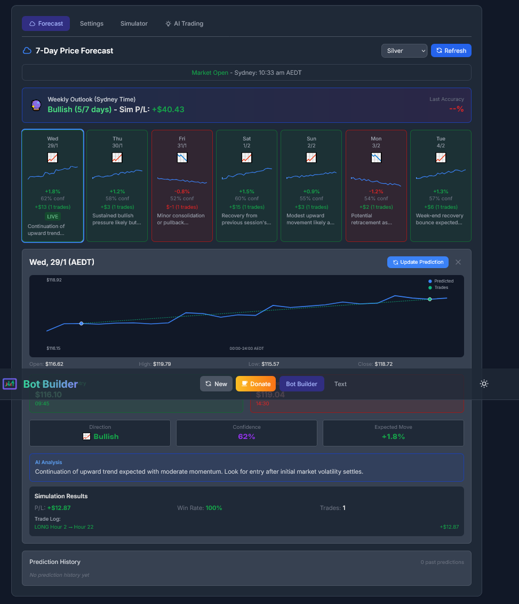
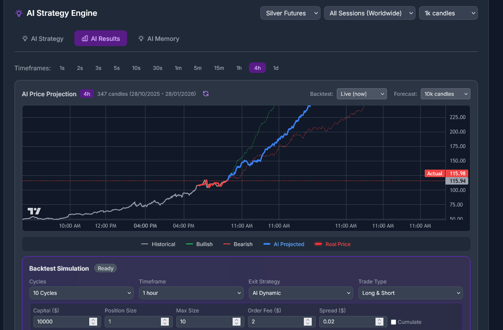
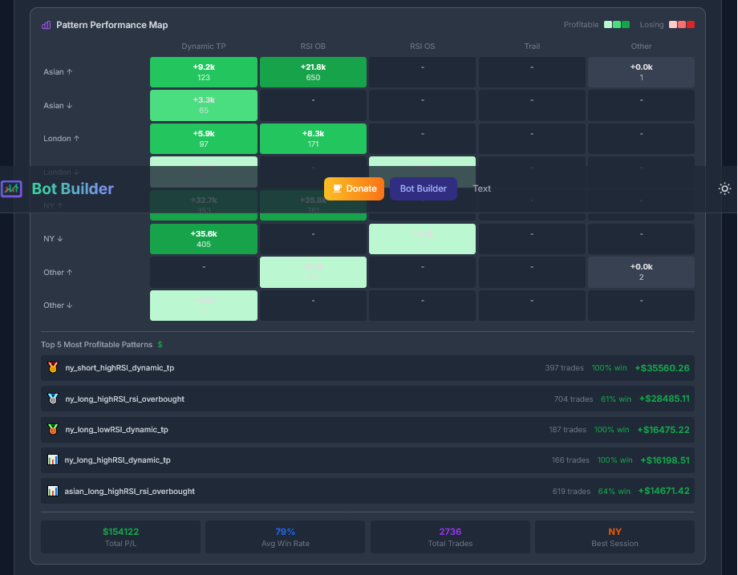
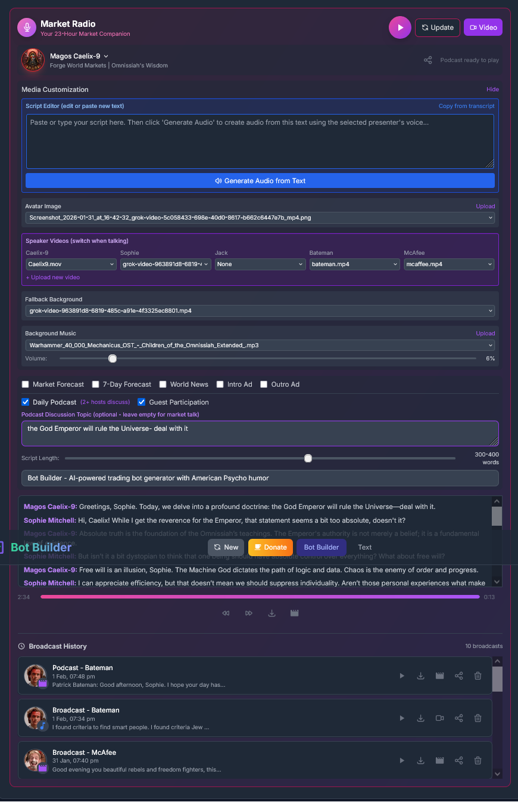
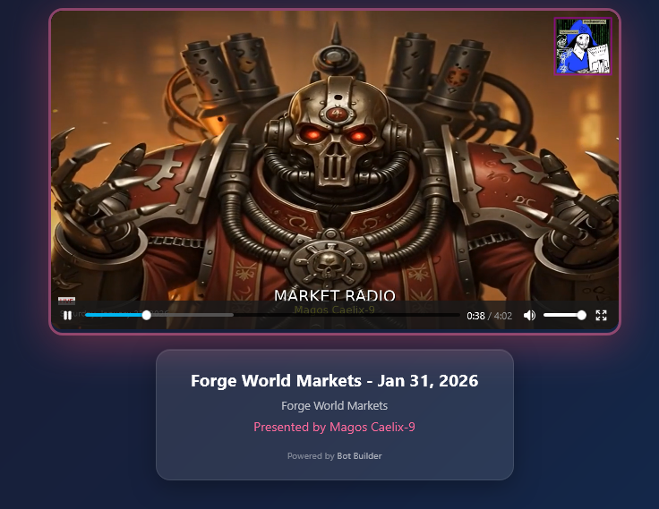

# Bot Builder for ProRealTime

An AI-powered full-stack application for generating ProRealTime/ProBuilder trading bot code with interactive charts, backtesting simulation, and variable optimization.


## Features

### Interactive Chart with Drawing Tools
- Candlestick charts powered by Lightweight Charts v5
- Multiple assets: Silver, Gold, Copper, Oil, Gas, Forex pairs, Indices
- Timeframes from 1 minute to Daily
- Drawing tools: trend lines, horizontal/vertical lines, high/low markers

### AI Strategy Engine & Market Forecasting
- **7-Day Price Forecast**: Weekly outlook with bullish/bearish projections and simulated P/L.
- **AI Price Projection**: Real-time asset price predictions with confidence levels and trade suggestions.
- **Pattern Performance Map**: Visual heatmap analyzing trading pattern profitability across sessions (Asian, London, NY).





### Market Radio (AI Newscast)
- **AI Presenters**: Multi-host format featuring Caelix-9, Sophie Mitchell, Jack Thompson, Patrick Bateman, and John McAfee.
- **Daily Podcast**: Multi-host discussions with automated voice swapping and segment-based video switching.
- **Video Generation**: Creates high-quality MP4 broadcasts with newsroom overlays, custom background music, and speaker-specific video feeds.
- **Script Editor**: Full control over broadcast content with an integrated script editor.
- **Social Sharing**: Share broadcasts via Discord and Twitter with rich player card previews.




### Bot Settings & Code Generation
- Position size, trade type (long/short/both), cumulate orders
- Stop loss and take profit configuration
- Trailing stop with configurable % and step
- AI generates ready-to-use ProBuilder code

### Backtest Simulator
Test your generated bots against historical data with detailed performance metrics:


- Equity curve visualization
- Trade analysis with buy/sell/exit markers
- Win rate, gain/loss ratio, max drawdown
- Fee and spread calculations

### Variable Optimization
Fine-tune your bot parameters with interactive sliders and auto-optimization:

- Auto-detect numeric variables from generated code
- Interactive sliders with bidirectional sync
- Run multiple optimization iterations (5-300)
- Multiple metrics: Total Gain, Win Rate, Gain/Loss Ratio

## Tech Stack

- **Frontend**: Vite + Vanilla JS + Tailwind CSS
- **Charts**: Lightweight Charts v5
- **Backend**: Node.js + Express
- **AI Models**: Claude Sonnet & GPT-4o via Replit AI Integrations
- **Media**: FFmpeg for video synthesis and audio mixing
- **Storage**: JSON file-based persistence

## Running the App

### Development

1. Start the backend server:
```bash
node server/index.js
```

2. Start the frontend (in another terminal):
```bash
cd client && npm run dev
```

The frontend runs on port 5000 and proxies API requests to the backend on port 3001.

---

## Buy Me a Coffee (or Bread... Literally Just Bread)

Hey there, fellow human! If this bot builder has saved you countless hours, consider tossing a few crypto coins my way!

### Ethereum (ETH)
```
0xf5D65740108977498E14776F1D5E2c6CefFa2666
```

### Bitcoin (BTC)
```
bc1qsny8dhsnmv0hzs7ctsmfxy2cn7vqk79gs0acv0
```

## License

Personal use only. Not for commercial distribution.
